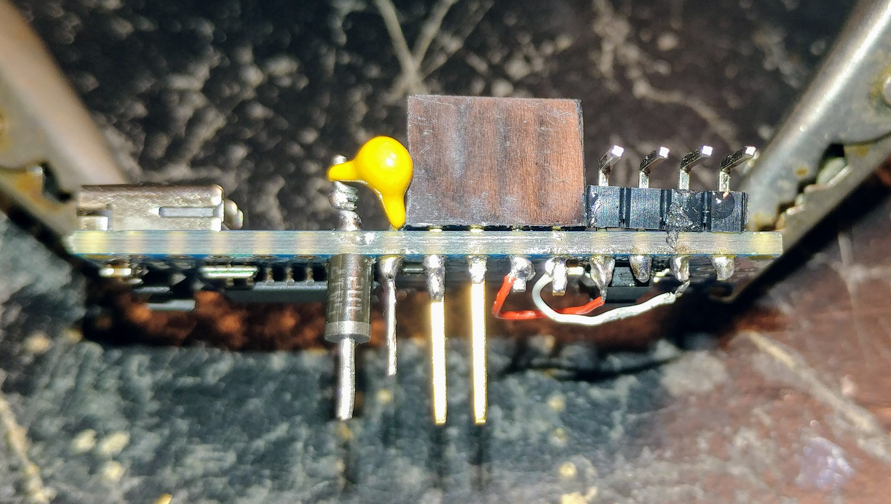

The very tiny RF tool uses nothing more than an Arduino Nano and an si5351 breakout board.
The tool is controlled by your PC radio applicion. 
Basically, the VFO-A appears on the clk0 output and the VFO-B frequency appears on the clk1 output.
Tested on fldigi, flrig, WSJT-X and Ham Radio Deluxe.
Also supported by the text protocal from an ascii terminal emulator (such as "Serial Tool" in the Arduino IDE.)

If attached, the RF tool will also display the two frequencies on the OLED display.
(OLED display software is being tidied up, RSN.)

In this very tiny project, a header is installed on the TOP of the Nano for a small (.096" or 1.1") OLED display.
I use extended headers; the only consideration is that the SCL and SDA pins extend down for the si5351 breakout board.
The header is not a necessity and wires can also be used extend above and below.
The OLED is powered by jumpering +5V and GND to the appropriate A6 and A7 pins.
These pins will not be available for other analog functions. (see radiopins.h)
All OLEDs that I've seen have the same SCL and SDA pin assignments, but the Power pins can go either way.
Pay attention.

A header for the si5351 breakout board is constructed beneath the Nano. 
It is powered by usind digitalWrite to provide power on A3 and ground on A2.
I use a Schottky diode as the power pin to provide reverse polarity protection.

The si5351 breakout board is soldered on an we're finished!

The software is controlled by and tested with fldigi, flrig, WSJT-X and Ham Radio Deluxe
by either selecting a Xiegu 5150 (for fldigi, get the latest version) or a Icom IC-754 or an IC-7000.
Default baud is 38400.

You will likely have to configure the rf clocks via the text interface. qiv.
If the IFs are defined a 0 for high and low,
the RF tool will work place the frequencies of VFO-A on the ckl0 output and VCO-B on the clk1 output.
Direct conversion mode.
Otherwise the software will read the IF frequency and, depending on the mode, 
place the calculated clocks on CLK0 and CLK1. 
Superheterodyne mode.

Look for support of the graphics display in the next veriosn.

